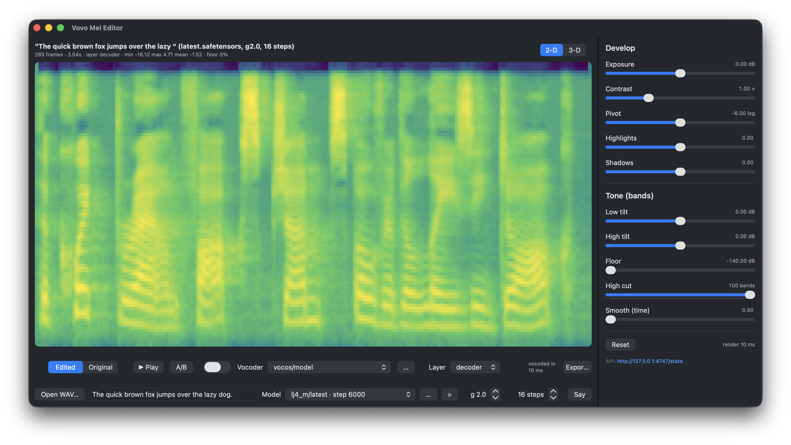
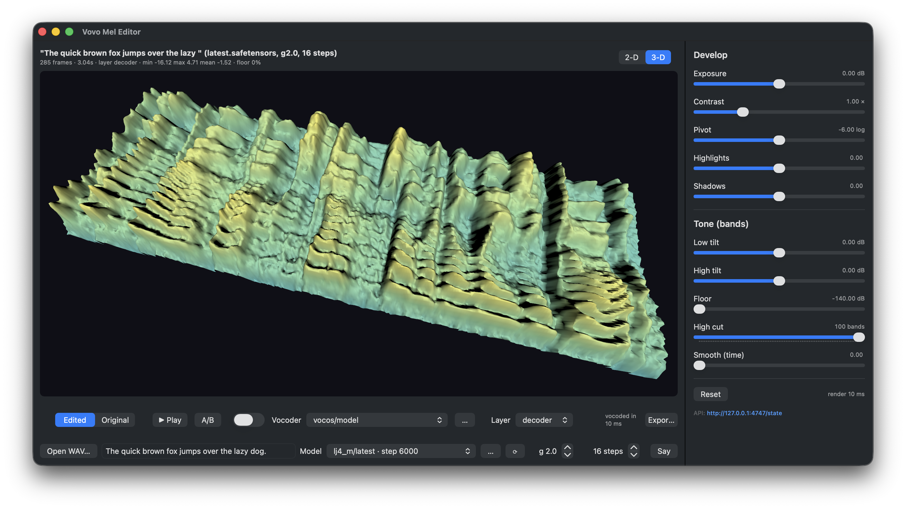

<!-- DRAFT — Franck reviews this file before anything is published. Screenshots: replace the placeholders below. -->

# vovo-mel-viz

A "Lightroom for mel spectrograms": a macOS app that shows the actual `[T, 100]` log-mel a TTS model produces,
lets you remap it with photo-style controls, re-runs the vocoder so you can *hear* the edit, and A/Bs it
against the original — live, mid-sentence. Built for [Vovo](https://github.com/franckverrot/vovo), a
from-scratch text-to-speech model in Swift + Metal, as a tool to find out *where* a voice's crackle lives.





## What it does

- **Sources**: any WAV (through the same mel extractor the model trains on), or a sentence synthesized by a
  Vovo checkpoint — with the decoder output and the encoder's prior μ as switchable layers.
- **View**: a Metal heatmap on a fixed colormap scale (so level errors don't hide behind auto-scaling), and a
  SceneKit 3-D terrain you can orbit.
- **Develop panel**: exposure, contrast around a pivot, highlights/shadows, low/high spectral tilt, high cut
  (mute bands above N), floor, temporal smoothing. Every move re-applies instantly and re-vocodes after a
  short debounce.
- **Listen**: Vocos or Griffin-Lim; play, A/B, and a **Live** loop that hot-swaps the audio at the playhead
  with a 20 ms crossfade so you hear a slider move within ~150 ms without restarting the sentence.
- **Models**: pick any acoustic checkpoint / vocoder found under `checkpoints/`, `exports/`, `assets/`
  (classified by reading the safetensors header), or browse for one. Switching re-synthesizes / re-vocodes.
- **Export**: original and edited WAV + PNG + the parameters as JSON.
- **Local API** on `127.0.0.1:4747` so the app can be driven and inspected from a shell (or by an agent):
  `GET /state`, `/mel.png`, `/audio.wav`, `/screenshot.png`, `/models`; `POST /load`, `/params`, `/vocoder`,
  `/models`, `/play`, `/stop`, `/view`, `/export`. Nothing leaves the machine.

## Build and run

The app is a SwiftUI + Metal + SceneKit executable that depends on Vovo's libraries (mel extraction, the
acoustic model, the Vocos vocoder). It lives as a submodule of the Vovo repository and builds from there:

```
git clone --recurse-submodules git@github.com:franckverrot/vovo.git
cd vovo/vovo-mel-viz
swift build -c release
cd .. && ./vovo-mel-viz/.build/release/vovo-mel        # run from the Vovo root so checkpoints/ and assets/ resolve
```

`VOVO_MEL_WAV=path.wav` preloads a file; `VOVO_MEL_PORT` changes the API port. Requires macOS 15+ on Apple
silicon. It never trains and never writes checkpoints — it only loads them.

### First launch: the weights

The app ships without weights. On first launch it says so and offers **Download Vovo voice (135 MB)**: one
click fetches the published acoustic model and vocoder from
[`franckverrot/vovo`](https://huggingface.co/franckverrot/vovo) (plain HTTPS, no account) into
`~/Library/Application Support/vovo-mel-viz/weights/` and selects them. Until then, WAVs still load and edit
(vocoded with Griffin-Lim). Any other `.safetensors` found under `checkpoints/`, `exports/` or `assets/` of
the current directory shows up in the Model / Vocoder menus, and `…` browses for one anywhere.
The same over the API: `POST /models {"download": true}`, then poll `GET /state` → `weights`.

## Remaps (the develop panel)

All remaps are per-cell functions of the log value `v` (log-mel, floor `log(1e-7)`), band index `b` and
frame `t`; `k = ln(10)/20` converts dB to log units:

| control | formula | question it asks |
|---|---|---|
| Exposure (dB) | `v += exposure·k` | is the vocoder level-sensitive? |
| Contrast, Pivot | `x = (v − pivot)·contrast` | dynamic range around the speech median |
| Highlights / Shadows | `x > 0 ? x·(1+h) : x·(1−s)` | loud vs quiet cells separately |
| Low / High tilt (dB) | `v += (tiltLow·(1−b/99) + tiltHigh·(b/99))·k` | spectral tilt |
| High cut | bands `≥ N` → floor | is the artifact in the top bands? |
| Floor (dB) | `v = max(v, floor)` | does hiss come from the floor? |
| Smooth | first-order EMA over frames | frame-to-frame jitter? |

## License

MIT.
